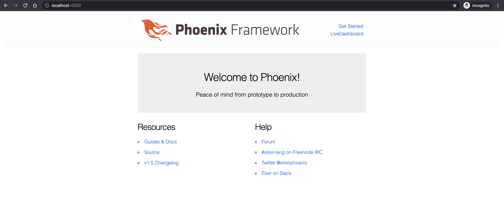

# Newsfeed Demo application to showcase Elixir + Phoenix integration with Apache kafka

This application purely for learning purpose. While learning Elixir and Phoenix framework 

Pre-requisite
* Some knowledge of asdf
* Idea about Elixir, Phoenix, Mix, Erlang :How these works

Lets start's and checkout this project.

#### Run below command
``` 
$ cd newsfeed/
$ asdf install
elixir 1.12.0-otp-24 is already installed
erlang 24.0.1 is already installed
nodejs 16.2.0 is already installed
```
To me it showing it is already installed, but in your case it will download the binaries and set up all three tools defined in .tools.version

Now run below commands to set up mix
```
$ mix local.hex --if-missing --force 
$ mix local.rebar --if-missing --force

01:27:56.934 [warn]  Description: 'Authenticity is not established by certificate path validation'
     Reason: 'Option {verify, verify_peer} and cacertfile/cacerts is missing'


01:27:57.276 [warn]  Description: 'Authenticity is not established by certificate path validation'
     Reason: 'Option {verify, verify_peer} and cacertfile/cacerts is missing'


01:27:57.339 [warn]  Description: 'Authenticity is not established by certificate path validation'
     Reason: 'Option {verify, verify_peer} and cacertfile/cacerts is missing'

* creating /Users/ritgirdh/.asdf/installs/elixir/1.12.0-otp-24/.mix/rebar

01:27:57.419 [warn]  Description: 'Authenticity is not established by certificate path validation'
     Reason: 'Option {verify, verify_peer} and cacertfile/cacerts is missing'


01:27:57.451 [warn]  Description: 'Authenticity is not established by certificate path validation'
     Reason: 'Option {verify, verify_peer} and cacertfile/cacerts is missing'


01:27:57.479 [warn]  Description: 'Authenticity is not established by certificate path validation'
     Reason: 'Option {verify, verify_peer} and cacertfile/cacerts is missing'

* creating /Users/<HOME>/.asdf/installs/elixir/1.12.0-otp-24/.mix/rebar3
```

### Now install Phoenix 1.5 using below command
``` 
$ mix archive.install hex phx_new 1.5.9
Resolving Hex dependencies...
Dependency resolution completed:
New:
  phx_new 1.5.9
* Getting phx_new (Hex package)
All dependencies are up to date
Compiling 10 files (.ex)
Generated phx_new app
Generated archive "phx_new-1.5.9.ez" with MIX_ENV=prod
Are you sure you want to install "phx_new-1.5.9.ez"? [Yn] Y
* creating /Users/<HOME>/.asdf/installs/elixir/1.12.0-otp-24/.mix/archives/phx_new-1.5.9
```

### Create Phoenix Project
``` 
$ mix phx.new newsfeed
* creating newsfeed/config/config.exs
* creating newsfeed/config/dev.exs
* creating newsfeed/config/prod.exs
* creating newsfeed/config/prod.secret.exs
* creating newsfeed/config/test.exs
* creating newsfeed/lib/newsfeed/application.ex
* creating newsfeed/lib/newsfeed.ex
* creating newsfeed/lib/newsfeed_web/channels/user_socket.ex
* creating newsfeed/lib/newsfeed_web/views/error_helpers.ex
* creating newsfeed/lib/newsfeed_web/views/error_view.ex
* creating newsfeed/lib/newsfeed_web/endpoint.ex
* creating newsfeed/lib/newsfeed_web/router.ex
* creating newsfeed/lib/newsfeed_web/telemetry.ex
* creating newsfeed/lib/newsfeed_web.ex
* creating newsfeed/mix.exs
* creating newsfeed/README.md
* creating newsfeed/.formatter.exs
* creating newsfeed/.gitignore
* creating newsfeed/test/support/channel_case.ex
* creating newsfeed/test/support/conn_case.ex
* creating newsfeed/test/test_helper.exs
* creating newsfeed/test/newsfeed_web/views/error_view_test.exs
* creating newsfeed/lib/newsfeed/repo.ex
* creating newsfeed/priv/repo/migrations/.formatter.exs
* creating newsfeed/priv/repo/seeds.exs
* creating newsfeed/test/support/data_case.ex
* creating newsfeed/lib/newsfeed_web/controllers/page_controller.ex
* creating newsfeed/lib/newsfeed_web/templates/layout/app.html.eex
* creating newsfeed/lib/newsfeed_web/templates/page/index.html.eex
* creating newsfeed/lib/newsfeed_web/views/layout_view.ex
* creating newsfeed/lib/newsfeed_web/views/page_view.ex
* creating newsfeed/test/newsfeed_web/controllers/page_controller_test.exs
* creating newsfeed/test/newsfeed_web/views/layout_view_test.exs
* creating newsfeed/test/newsfeed_web/views/page_view_test.exs
* creating newsfeed/lib/newsfeed_web/gettext.ex
* creating newsfeed/priv/gettext/en/LC_MESSAGES/errors.po
* creating newsfeed/priv/gettext/errors.pot
* creating newsfeed/assets/webpack.config.js
* creating newsfeed/assets/.babelrc
* creating newsfeed/assets/js/app.js
* creating newsfeed/assets/css/app.scss
* creating newsfeed/assets/js/socket.js
* creating newsfeed/assets/package.json
* creating newsfeed/assets/static/favicon.ico
* creating newsfeed/assets/css/phoenix.css
* creating newsfeed/assets/static/images/phoenix.png
* creating newsfeed/assets/static/robots.txt

Fetch and install dependencies? [Yn] Y
* running mix deps.get
* running mix deps.compile
* running cd assets && npm install && node node_modules/webpack/bin/webpack.js --mode development

We are almost there! The following steps are missing:

    $ cd newsfeed
    $ cd assets && npm install && node node_modules/webpack/bin/webpack.js --mode development

Then configure your database in config/dev.exs and run:

    $ mix ecto.create

Start your Phoenix app with:

    $ mix phx.server

You can also run your app inside IEx (Interactive Elixir) as:

    $ iex -S mix phx.server

```

We have created a Phoenix project , now quicky start it 

``` 
$ cd assets && npm install && node node_modules/webpack/bin/webpack.js --mode development
npm ERR! code 1
npm ERR! path /Users/ritgirdh/Desktop/codebase/study/elixir-learning/Elixir-phoenix-kafka-integration/newsfeed/assets/node_modules/node-sass
```

If you are facing above issue, then you have to follow below steps 
```
$ cd newsfeed/assets/ 
## open package.json and remove "node-sass": "^4.13.1" entry with the  "sass": "^1.32.8",
```

#### Now run again
```
cd assets && npm install && node node_modules/webpack/bin/webpack.js --mode development
.....
.....
added 812 packages, and audited 815 packages in 18s
```

#### Asset compilation is done

#### Now lets configure postgres. Update username, password and database with the one you have on your local
``` 
config :newsfeed, Newsfeed.Repo,
  username: "ritgirdh",
  password: "",
  database: "newsfeed_dev",
  hostname: "localhost",
  show_sensitive_data_on_connection_error: true,
  pool_size: 10
```

#### Now run below command to set up the project 

``` 
$ mix ecto.create
Compiling 14 files (.ex)
Generated newsfeed app
The database for Newsfeed.Repo has been created
```

#### Now run below command to start the phoenix project 
``` 
mix phx.server
```

### Hurrey, you have successfully set up phoenix project


---

### Now Add Kafka dependencies in Elixir  

Add kafka dependency in mix.exs
```
 defp deps do
    [
         ...
         {:kaffe, "~> 1.9"}
    ]
```

#### Pull the dependency 
``` 
$ mix deps.get
Resolving Hex dependencies...
Dependency resolution completed:
Unchanged:
  connection 1.1.0
  cowboy 2.9.0
  cowboy_telemetry 0.3.1
  cowlib 2.11.0
  db_connection 2.4.0
  decimal 2.0.0
  ecto 3.6.2
  ecto_sql 3.6.2
  file_system 0.2.10
  gettext 0.18.2
  jason 1.2.2
  mime 1.6.0
  phoenix 1.5.9
  phoenix_ecto 4.2.1
  phoenix_html 2.14.3
  phoenix_live_dashboard 0.4.0
  phoenix_live_reload 1.3.1
  phoenix_live_view 0.15.7
  phoenix_pubsub 2.0.0
  plug 1.11.1
  plug_cowboy 2.5.0
  plug_crypto 1.2.2
  postgrex 0.15.9
  ranch 1.8.0
  telemetry 0.4.3
  telemetry_metrics 0.6.0
  telemetry_poller 0.5.1
New:
  brod 3.15.6
  crc32cer 0.1.4
  kaffe 1.20.0
  kafka_protocol 2.3.6
  retry 0.14.1
  snappyer 1.2.5
  supervisor3 1.1.11
* Getting kaffe (Hex package)
* Getting brod (Hex package)
* Getting retry (Hex package)
* Getting kafka_protocol (Hex package)
* Getting supervisor3 (Hex package)
* Getting crc32cer (Hex package)
* Getting snappyer (Hex package)
```

### Start kafka server, Skip this step if you already have kafka server running.

``` 
$ docker run -d --name zookeeper -p 2181:2181 jplock/zookeeper
$ docker run -d --name kafka -p 7203:7203 -p 9092:9092 -e KAFKA_ADVERTISED_HOST_NAME=192.168.1.4 -e ZOOKEEPER_IP=192.168.1.4 ches/kafka
$ docker run --rm ches/kafka kafka-topics.sh --create --topic newsfeed  --replication-factor 1 --partitions 1 --zookeeper 192.168.1.4
Created topic "newsfeed".
$ docker run --rm ches/kafka kafka-topics.sh --list --zookeeper  192.168.43.198
__consumer_offsets
newsfeed
```

#### In the elixir server console you will see below kind of logs, which means our phoenix application is able to listen to kafka
``` 
:supervisor: {:local, :brod_sup}
    :started: [
  pid: #PID<0.1150.0>,
  id: :"learning-elixir",
  mfargs: {:brod_client, :start_link,
   [
     [{'localhost', 9092}],
     :"learning-elixir",
     [
       auto_start_producers: false,
       allow_topic_auto_creation: false,
       begin_offset: -1
     ]
   ]},
  restart_type: {:permanent, 10},
  shutdown: 5000,
  child_type: :worker
]

```

#### Push some messages into Kafka for testing
``` 
$ docker run --rm --interactive ches/kafka kafka-console-producer.sh --topic newsfeed --broker-list 192.168.1.4:9092
Lack of burial space is changing age-old funeral practices, and in Japan ???tree burials' are gaining
```

#### You could see same message in phoenix server console.
``` 
%{
  headers: [],
  key: "",
  offset: 3,
  partition: 0,
  topic: "newsfeed",
  ts: 1623334135536,
  ts_type: :create,
  value: "Lack of burial space is changing age-old funeral practices, and in Japan ???tree burials' are gaining"
}
: Lack of burial space is changing age-old funeral practices, and in Japan ???tree burials' are gaining

```

### Firstly, Let's create the News feed controller


